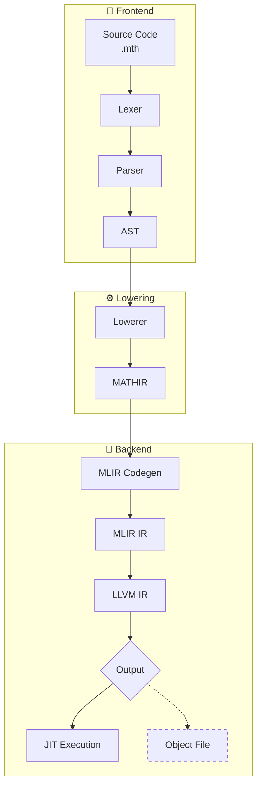

<div align="center">

# 🧮 Mathic

*A programming language with builtin symbolic algebra capabilities, powered by LLVM/MLIR*

</div>

## 🔧 Dependencies

- **Rust** 1.93 or higher
- **LLVM/MLIR** 21.x.x 

### LLVM/MLIR Installation

There are many ways of installing LLVM. The most common one is by building it from source.

1. **Clone LLVM Project**
   ```bash
   git clone https://github.com/llvm/llvm-project.git
   cd llvm-project
   mkdir build && cd build
   ```

2. **Configure Build**
   ```bash
   cmake -G Ninja ../llvm \
       -DLLVM_ENABLE_PROJECTS="mlir" \
       -DCMAKE_BUILD_TYPE=RelWithDebInfo \
       -DLLVM_ENABLE_ASSERTIONS=On \
       -DLLVM_USE_LINKER=mold \
       -DLLVM_BUILD_LLVM_DYLIB=On \
       -DLLVM_LINK_LLVM_DYLIB=On \
       -DMLIR_BUILD_MLIR_C_DYLIB=On \
       -DLLVM_TARGETS_TO_BUILD=host \
       -DCMAKE_INSTALL_PREFIX=/opt/llvm-21
   ```

3. **Build and Install**
   ```bash
   ninja install
   ```

## 🚀 Usage

Before building or running the compiler, you need to export the required environment variables:

```sh
export LLVM_SYS_211_PREFIX=<path-to-llvm-build>
export MLIR_SYS_210_PREFIX=<path-to-llvm-build>
export TABLEGEN_210_PREFIX=<path-to-llvm-build>
```

After that, you can run the compiler:

```bash
cargo --bin euler -- <path-to-file>.mth 
```

## 📖 Current Status

> ⚠️ **Note**: This project is in early development. Features are being added incrementally.

---

## 🏗️ Project Structure

```
src/
├── bin/
│   └── euler.rs          # Binary entry point
├── codegen.rs            # MLIR Generation
├── codegen/             
│   ├── declaration.rs
│   ├── error.rs
│   ├── expression.rs
│   ├── statement.rs
│   └── symbol_table.rs
├── compiler.rs           # Compiler driver
├── error.rs              # MathicError
├── error_reporter.rs     # Error reporting entry point
├── error_reporter/       # Centralized error reporters
│   ├── lowering.rs
│   └── parser.rs
├── executor.rs           # JIT execution
├── ffi.rs               # MLIR/LLVM FFI bindings
├── lowering.rs          # Lowerer entry point
├── lowering/            # AST → IR lowering
│   ├── ast_lowering.rs  # Lowerings entry point
│   ├── error.rs         # Semantic Errors
│   ├── ir.rs            # Ir struct definition
│   ├── ir/              # IR definitions
│   │   ├── basic_block.rs
│   │   ├── function.rs
│   │   ├── instruction.rs
│   │   └── value.rs
│   └── ast_lowering/    # AST → IR transformation
│       ├── control_flow.rs
│       ├── expression.rs
│       └── statement.rs
├── parser.rs            # Parser entry point
└── parser/              # Frontend: Lexing and Parsing
    ├── ast.rs           # Program definition
    ├── ast/             # AST nodes
    │   ├── control_flow.rs
    │   ├── declaration.rs
    │   ├── expression.rs
    │   └── statement.rs
    ├── error.rs         # Lexical and Syntactic errors
    ├── lexer.rs         # Lexer definition
    ├── parsing/         # Recursive descent parser
    │   ├── control_flow.rs
    │   ├── declaration.rs
    │   ├── expression.rs
    │   └── statement.rs
    └── token.rs         # Token enum
```

### Pipeline



- **MATHIR**: Mathic Intermediate Representation that sits between AST and MLIR.
- **MLIR**: Multi-Level Intermediate Representation. Used as a flexible IR that preserves high-level constructs (functions, control flow) while enabling transformations.
- **LLVM IR**: The compilation target. Low-level intermediate representation optimized by LLVM passes.

---

<div align="center">

**Built with ❤️ and 🦀 Rust**

</div>
