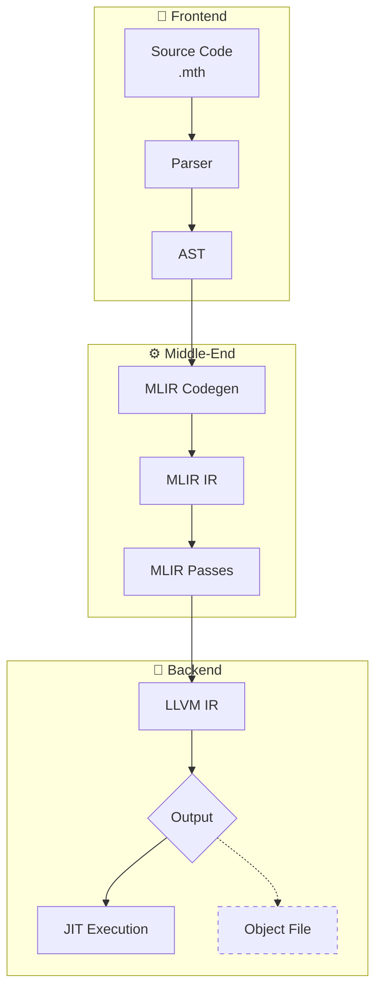

<div align="center">

# 🧮 Mathic

*A programming language with builtin symbolic algebra capabilities, powered by LLVM/MLIR*

</div>

## 🔧 Dependencies

- **Rust** 1.93 or higher
- **LLVM/MLIR** 21.x.x 

### LLVM/MLIR Installation

There are many ways of installing LLVM. The most common one is by building it from source.

1. **Clone LLVM Project**
   ```bash
   git clone https://github.com/llvm/llvm-project.git
   cd llvm-project
   mkdir build && cd build
   ```

2. **Configure Build**
   ```bash
   cmake -G Ninja ../llvm \
       -DLLVM_ENABLE_PROJECTS="mlir" \
       -DCMAKE_BUILD_TYPE=RelWithDebInfo \
       -DLLVM_ENABLE_ASSERTIONS=On \
       -DLLVM_USE_LINKER=mold \
       -DLLVM_BUILD_LLVM_DYLIB=On \
       -DLLVM_LINK_LLVM_DYLIB=On \
       -DMLIR_BUILD_MLIR_C_DYLIB=On \
       -DLLVM_TARGETS_TO_BUILD=host \
       -DCMAKE_INSTALL_PREFIX=/opt/llvm-21
   ```

3. **Build and Install**
   ```bash
   ninja install
   ```

## 🚀 Usage

Before building or running the compiler, you need to export the required environment variables:

```sh
export LLVM_SYS_211_PREFIX=<path-to-llvm-build>
export MLIR_SYS_210_PREFIX=<path-to-llvm-build>
export TABLEGEN_210_PREFIX=<path-to-llvm-build>
```

After that, you can run the compiler:

```bash
cargo --bin euler -- <path-to-file>.mth 
```

## 📖 Current Status

> ⚠️ **Note**: This project is in early development. Features are being added incrementally.

### 🏗️ Language Features

#### Statements
- ✅ **Function declarations** (`df` keyword)
- ✅ **Return statements**
- ✅ **Block statements**
- ✅ **Variable declarations** (`let` keyword)
- ✅ **Variable assignments**
- 🚧 **Struct declarations**
- 🚧 **Symbolic declarations**

#### Control Flow
- ✅ **If statements**
- ✅ **While loops**
- ✅ **For loops**

#### Expressions
- ✅ **Primary expressions** (identifiers, numbers, booleans)
- ✅ **Arithmetic operations** (+, -, *, /)
- ✅ **Comparison operations** (==, !=, >, >=, <, <=)
- ✅ **Logical operations** (and, or)
- ✅ **Unary operations** (!, -)
- ✅ **Function calls**
- ✅ **Parenthesized expressions**

---

## 🏗️ Project Structure

The compiler is organized into three main phases:

```
src/
├── parser/           # Frontend: Lexing and Parsing
│   ├── lexer.rs      # Token definitions (Logos-based)
│   ├── ast/          # AST node definitions
│   ├── parsing/      # Recursive descent parser
│   └── token.rs      # Token enum
├── codegen/          # Middle-end: MLIR Generation
│   ├── mod.rs        # Codegen context and entry point
│   ├── declaration.rs # Function/variable compilation
│   ├── statement.rs  # Statements (return, assign)
│   ├── expression.rs # Expressions (binops, calls)
│   ├── control_flow.rs # If/while/for compilation
│   └── symbol_table.rs # Variable scoping
├── compiler.rs       # Compiler driver (parse → MLIR → passes)
├── executor.rs       # JIT execution using LLVM ORC
└── ffi.rs            # MLIR/LLVM FFI bindings
```

### Pipeline



- **MLIR**: Multi-Level Intermediate Representation. Used as a flexible IR that preserves high-level constructs (functions, control flow) while enabling transformations.
- **LLVM IR**: The compilation target. Low-level intermediate representation optimized by LLVM passes.

See [TODO.md](TODO.md) for known issues and planned features.

---

<div align="center">

**Built with ❤️ and 🦀 Rust**

</div>
