<div align="center">

# 🧮 Mathic

*A programming language with builtin symbolic algebra capabilities, powered by LLVM/MLIR*

</div>

## 🔧 Dependencies

- **Rust** 1.93 or higher
- **LLVM/MLIR** 21.x.x 

### LLVM/MLIR Installation

There are many ways of installing LLVM. The most common one is by building it from source.

1. **Clone LLVM Project**
   ```bash
   git clone https://github.com/llvm/llvm-project.git
   cd llvm-project
   mkdir build && cd build
   ```

2. **Configure Build**
   ```bash
   cmake -G Ninja ../llvm \
       -DLLVM_ENABLE_PROJECTS="mlir" \
       -DCMAKE_BUILD_TYPE=RelWithDebInfo \
       -DLLVM_ENABLE_ASSERTIONS=On \
       -DLLVM_USE_LINKER=mold \
       -DLLVM_BUILD_LLVM_DYLIB=On \
       -DLLVM_LINK_LLVM_DYLIB=On \
       -DMLIR_BUILD_MLIR_C_DYLIB=On \
       -DLLVM_TARGETS_TO_BUILD=host \
       -DCMAKE_INSTALL_PREFIX=/opt/llvm-21
   ```

3. **Build and Install**
   ```bash
   ninja install
   ```

## 🚀 Usage

Before building or running the compiler, you need to export the required environment variables:

```sh
export LLVM_SYS_211_PREFIX=<path-to-llvm-build>
export MLIR_SYS_210_PREFIX=<path-to-llvm-build>
export TABLEGEN_210_PREFIX=<path-to-llvm-build>
```

After that, you can run the compiler:

```bash
cargo --bin euler -- <path-to-file>.mth 
```

## 📖 Current Status

> ⚠️ **Note**: This project is in early development. Features are being added incrementally.

### 🏗️ Language Features

#### Statements
- ✅ **Function declarations** (`df` keyword)
- ✅ **Return statements**
- ✅ **Block statements**
- ✅ **Variable declarations** (`let` keyword)
- ✅ **Variable assignments**
- 🚧 **Struct declarations**
- 🚧 **Symbolic declarations**

#### Control Flow
- ✅ **If statements**
- ✅ **While loops**
- ✅ **For loops**

#### Expressions
- ✅ **Primary expressions** (identifiers, numbers, booleans)
- ✅ **Arithmetic operations** (+, -, *, /)
- ✅ **Comparison operations** (==, !=, >, >=, <, <=)
- ✅ **Logical operations** (and, or)
- ✅ **Unary operations** (!, -)
- ✅ **Function calls**
- ✅ **Parenthesized expressions**

---

## 🏗️ Project Structure

```
src/
├── parser.rs              # Parser entry point
├── parser/               # Frontend: Lexing and Parsing
│   ├── lexer.rs         # Lexer definition
│   ├── token.rs         # Token enum
│   ├── error.rs         # Parse errors
│   ├── reporter.rs       # Error reporting
│   ├── ast.rs           # Program definition
│   ├── ast/             # AST nodes
│   │   ├── expression.rs
│   │   ├── statement.rs
│   │   ├── control_flow.rs
│   │   └── declaration.rs
│   └── parsing/         # Recursive descent parser
│       ├── expression.rs
│       ├── statement.rs
│       ├── control_flow.rs
│       └── declaration.rs
├── lowering.rs           # Lowerer entry point
├── lowering/             # AST → IR lowering
│   ├── ir.rs            # IR definition
│   └── ir/              
│       ├── basic_block.rs
│       ├── function.rs
│       ├── instruction.rs
│       └── value.rs
├── codegen.rs           # MLIR Generation
├── codegen/             
│   ├── expression.rs
│   ├── statement.rs
│   ├── control_flow.rs
│   ├── declaration.rs
│   ├── symbol_table.rs
│   └── error.rs
├── compiler.rs           # Compiler driver
├── executor.rs           # JIT execution
├── ffi.rs               # MLIR/LLVM FFI bindings
├── error.rs             # Error types
└── bin/
    └── euler.rs         # Binary entry point
```

### Pipeline

```mermaid
flowchart TD
    subgraph Frontend["📝 Frontend"]
        Source[Source Code<br/>.mth]
        Lexer[Lexer]
        Parser[Parser]
        AST[AST]
        Source --> Lexer --> Parser --> AST
    end

    subgraph Lowering["⚙️ Lowering"]
        AST --> Lowerer[Lowerer]
        Lowerer --> IR[Mathic IR]
    end

    subgraph Backend["🔧 Backend"]
        IR --> Codegen[MLIR Codegen]
        Codegen --> MLIR[MLIR IR]
        MLIR --> LLVM[LLVM IR]
        LLVM --> Output{Output}
        Output --> JIT[JIT Execution]
        Output -.-> OBJ[Object File]
    end

    style OBJ stroke-dasharray: 5 5
```



- **IR**: Intermediate Representation. Variable-based, non-SSA format that sits between AST and MLIR.
- **MLIR**: Multi-Level Intermediate Representation. Used as a flexible IR that preserves high-level constructs (functions, control flow) while enabling transformations.
- **LLVM IR**: The compilation target. Low-level intermediate representation optimized by LLVM passes.

See [TODO.md](TODO.md) for known issues and planned features.

---

<div align="center">

**Built with ❤️ and 🦀 Rust**

</div>
