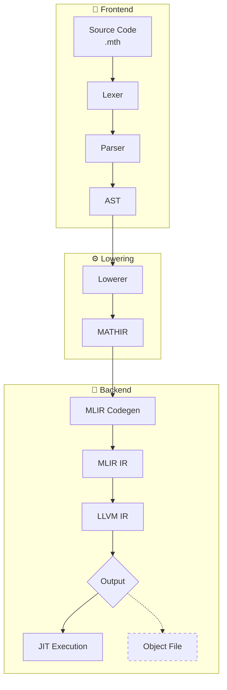

## Glossary

| Section | Description |
|---------|-------------|
| [Project Structure](#project-structure) | Tree view of the source code organization |
| [Pipeline](#pipeline) | Visual diagram of the compilation stages |
| [Symbolic Dialect](dialects/Symbolic.md) | The `symbolic` MLIR dialect: types, operations, and project structure |
| [Symbolic Passes](dialects/SymbolicPasses.md) | Lowering passes: `symbolic-extract-eval` and `symbolic-to-arith` |

## Project Structure

```
src/
├── bin/
│   └── euler.rs              # Binary entry point
├── codegen/                  # MLIR code generation
│   ├── compiler_helper/
│   │   └── debugging.rs
│   ├── compiler_helper.rs
│   ├── dialect_integration.rs # MLIR op builders for symbolic dialect
│   ├── function_ctx.rs       # Function context (locals, blocks)
│   ├── lvalue.rs             # Statement compilation
│   └── rvalue.rs             # Expression / symbolic compilation
├── codegen.rs                # Module re-export
├── compiler.rs               # Compiler driver
├── diagnostics/              # Error types
│   ├── codegen.rs
│   ├── lowering.rs
│   └── parse.rs
├── diagnostics.rs            # Module re-export
├── executor.rs               # JIT execution
├── ffi/                      # C FFI to shared libraries
│   └── dialect_integration.rs
├── ffi.rs                    # LLVM FFI bindings
├── lib.rs                    # Crate root
├── lowering/                 # AST → MATHIR lowering
│   ├── ast_lowering/        # AST → MATHIR transformation
│   │   ├── control_flow.rs
│   │   ├── declaration.rs
│   │   ├── expression.rs
│   │   └── statement.rs
│   ├── ir/                  # MATHIR definitions
│   │   ├── adts.rs
│   │   ├── basic_block.rs
│   │   ├── function.rs
│   │   ├── instruction.rs
│   │   ├── ir_walk.rs
│   │   ├── symbols.rs
│   │   ├── types.rs
│   │   └── value.rs
│   ├── ast_lowering.rs
│   └── ir.rs
├── lowering.rs               # Module re-export
├── parser/                   # Frontend: lexing and parsing
│   ├── ast/                 # AST nodes
│   │   ├── control_flow.rs
│   │   ├── declaration.rs
│   │   ├── expression.rs
│   │   └── statement.rs
│   ├── parsing/             # Recursive descent parser
│   │   ├── control_flow.rs
│   │   ├── declaration.rs
│   │   ├── expression.rs
│   │   └── statement.rs
│   ├── ast.rs
│   ├── lexer.rs
│   ├── parsing.rs
│   └── token.rs
└── parser.rs                 # Module re-export
```

## Pipeline


```mermaid
flowchart TD
    subgraph Frontend["📝 Frontend"]
        Source[Source Code<br/>.mth]
        Lexer[Lexer]
        Parser[Parser]
        AST[AST]
        Source --> Lexer --> Parser --> AST
    end

    subgraph Lowering["⚙️ Lowering"]
        AST --> Lowerer[Lowerer]
        Lowerer --> IR[MATHIR]
    end

    subgraph Backend["🔧 Backend"]
        IR --> Codegen[MLIR Codegen]
        Codegen --> MLIR[MLIR IR]
        MLIR --> LLVM[LLVM IR]
        LLVM --> Output{Output}
        Output --> JIT[JIT Execution]
        Output -.-> OBJ[Object File]
    end

    style OBJ stroke-dasharray: 5 5
```

- **MATHIR**: Mathic Intermediate Representation that sits between AST and MLIR.
- **MLIR + symbolic dialect**: Standard MLIR dialects plus the custom `symbolic` dialect for symbolic expressions.
- **symbolic-extract-eval / symbolic-to-arith**: C++ passes that lower the `symbolic` dialect to standard MLIR. See [Symbolic Passes](dialects/SymbolicPasses.md).
- **LLVM IR**: The compilation target. Low-level intermediate representation optimized by LLVM passes.
