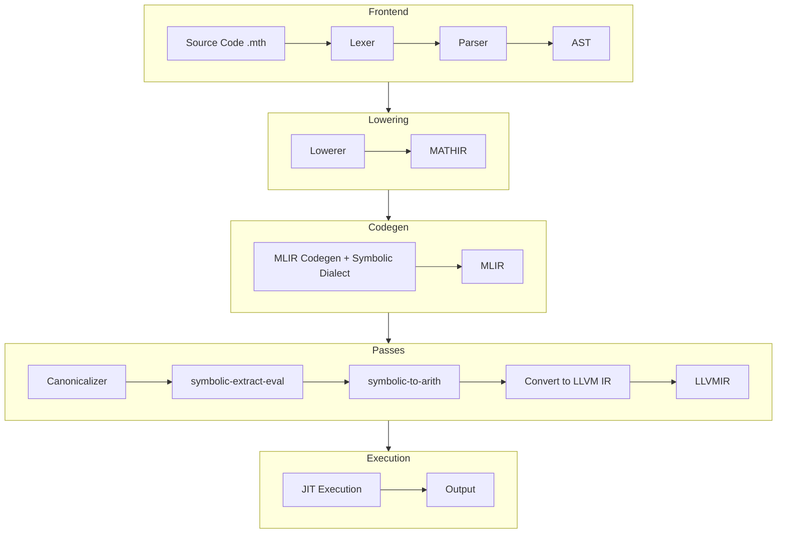

## Glossary

| Section | Description |
|---------|-------------|
| [Project Structure](#project-structure) | Tree view of the source code organization |
| [Pipeline](#pipeline) | Visual diagram of the compilation stages |
| [Compilation Process](#mathics-compilation-process) | The process to compile Mathic |
| [Symbolic Dialect](dialects/Symbolic.md) | The `symbolic` MLIR dialect: types, operations, and project structure |
| [Symbolic Passes](dialects/SymbolicPasses.md) | Lowering passes: `symbolic-extract-eval` and `symbolic-to-arith` |

## Project Structure

```
src/
├── bin/
│   └── euler.rs                   # Binary entry point
├── codegen/                       # MLIR code generation
│   ├── compiler_helper/
│   │   └── debugging.rs
│   ├── compiler_helper.rs
│   ├── dialect_integration.rs     # MLIR op builders for symbolic dialect
│   ├── function_ctx.rs            # Function context (locals, blocks)
│   ├── lvalue.rs                  # Statement compilation
│   └── rvalue.rs                  # Expression / symbolic compilation
├── codegen.rs                     # Module re-export
├── compiler.rs                    # Compiler driver
├── diagnostics/                   # Error types
│   ├── codegen.rs
│   ├── lowering.rs
│   └── parse.rs
├── diagnostics.rs                 # Module re-export
├── executor.rs                    # JIT execution
├── ffi/                           # C FFI to shared libraries
│   └── dialect_integration.rs
├── ffi.rs                         # LLVM FFI bindings
├── lib.rs                         # Crate root
├── lowering/                      # AST → MATHIR lowering
│   ├── ast_lowering/              # AST → MATHIR transformation
│   │   ├── control_flow.rs
│   │   ├── declaration.rs
│   │   ├── expression.rs
│   │   └── statement.rs
│   ├── ir/                        # MATHIR definitions
│   │   ├── adts.rs
│   │   ├── basic_block.rs
│   │   ├── function.rs
│   │   ├── instruction.rs
│   │   ├── ir_walk.rs
│   │   ├── symbols.rs
│   │   ├── types.rs
│   │   └── value.rs
│   ├── ast_lowering.rs
│   └── ir.rs
├── lowering.rs                    # Module re-export
├── parser/                        # Frontend: lexing and parsing
│   ├── ast/                       # AST nodes
│   │   ├── control_flow.rs
│   │   ├── declaration.rs
│   │   ├── expression.rs
│   │   └── statement.rs
│   ├── parsing/                   # Recursive descent parser
│   │   ├── control_flow.rs
│   │   ├── declaration.rs
│   │   ├── expression.rs
│   │   └── statement.rs
│   ├── ast.rs
│   ├── lexer.rs
│   ├── parsing.rs
│   └── token.rs
└── parser.rs                      # Module re-export
Dialects/                          # Custom MLIR dialect (C++)
└── Symbolic/                      # The `symbolic` dialect (see dialects/Symbolic.md)
tests/                             # Integration tests
```

## Mathic's Compilation Process

This section describes how Mathic gets compiled to an MLIR module to be used with the JIT Engine.

### General Flow


```mermaid
flowchart TD
    subgraph Frontend["Frontend"]
        direction LR
        Source[Source Code .mth] --> Lexer --> Parser --> AST
    end

    subgraph Lowering["Lowering"]
        direction LR
        Lowerer --> MATHIR
    end

    subgraph Codegen["Codegen"]
        direction LR
        MLIR[MLIR Codegen + Symbolic Dialect]
        MLIR --> MLIROut[MLIR]
    end

    subgraph Passes["Passes"]
        direction LR
        Canonicalizer --> ExtractEval[symbolic-extract-eval] --> ToArith[symbolic-to-arith] --> LLVM[Convert to LLVM IR] --> LLVMIR
    end

    subgraph Execution["Execution"]
        direction LR
        JIT[JIT Execution] --> Output
    end

    Frontend --> Lowering --> Codegen
    Codegen --> Passes
    Passes --> Execution
```

- **Frontend**: Lexes and parses `.mth` source files into an AST.
- **Lowering**: Transforms the AST into MATHIR (Mathic IR).
- **Codegen**: Lowers MATHIR to MLIR with the custom `symbolic` dialect.
- **Passes**: Canonicalization, symbolic lowering, and conversion to LLVM IR. See [Symbolic Passes](dialects/SymbolicPasses.md).
- **Execution**: JIT-compiles LLVM IR and runs the program.

### In-Depth Sections

| Section | Description |
| [Lowering a program to MATHIR](compilation_process/middleend.md)| Mathic's Intermediate Representation |
| [Lowering MATHIR to MLIR](compilation_process/backend.md) | Mathic's MLIR use |
| [Symbolic Dialect](compilation_process/dialects/Symbolic.md) | The `symbolic` MLIR dialect: types, operations, and project structure |
| [Symbolic Passes](compilation_process/dialects/SymbolicPasses.md) | Lowering passes: `symbolic-extract-eval` and `symbolic-to-arith` |