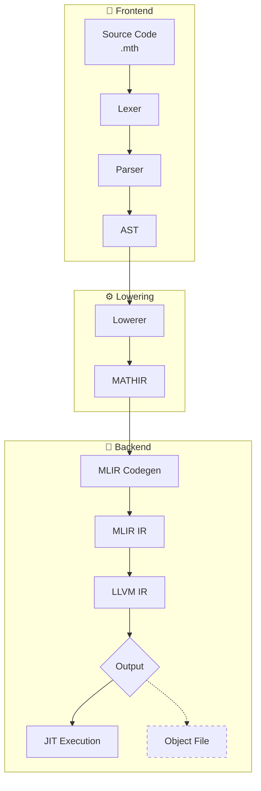

## Glossary

| Section | Description |
|---------|-------------|
| [Project Structure](#project-structure) | Tree view of the source code organization |
| [Pipeline](#pipeline) | Visual diagram of the compilation stages |
| [Dialects](Dialects.md) | The `symbolic` MLIR dialect and its lowering pipeline |

## Project Structure

```
src/
├── bin/
│   └── euler.rs              # Binary entry point
├── codegen.rs                # MLIR Generation
├── codegen/
│   ├── compiler_helper.rs    # Compiler utilities
│   ├── compiler_helper/
│   │   └── debugging.rs      # Debug helpers
│   ├── function_ctx.rs       # Function context
│   ├── lvalue.rs             # Statement compilation (let, assign, struct set)
│   └── rvalue.rs             # Expression compilation
├── compiler.rs               # Compiler driver
├── diagnostics.rs            # Error handling entry point
├── diagnostics/              # Unified diagnostics
│   ├── codegen.rs           # Codegen errors
│   ├── lowering.rs          # Semantic errors
│   └── parse.rs             # Lexical and syntactic errors
├── executor.rs               # JIT execution
├── ffi.rs                    # MLIR/LLVM FFI bindings
├── lowering.rs               # Lowerer entry point
├── lowering/                 # AST → IR lowering
│   ├── ast_lowering.rs      # Lowerings entry point
│   ├── ir.rs                # Ir struct definition
│   ├── ir/                  # IR definitions
│   │   ├── adts.rs          # ADT definitions (StructAdt)
│   │   ├── basic_block.rs    # Basic block definitions
│   │   ├── function.rs       # Function definitions
│   │   ├── instruction.rs    # Instructions (RValInstruct, LValInstruct)
│   │   ├── ir_walk.rs       # IR traversal helpers
│   │   ├── symbols.rs       # Symbol and Declaration tables
│   │   ├── types.rs         # Type definitions (MathicType, etc.)
│   │   └── value.rs         # Value definitions
│   └── ast_lowering/        # AST → MATHIR transformation
│       ├── control_flow.rs
│       ├── declaration.rs
│       ├── expression.rs
│       └── statement.rs
├── parser.rs                 # Parser entry point
├── parser/                   # Frontend: Lexing and Parsing
│   ├── ast.rs               # Program definition
│   ├── ast/                 # AST nodes
│   │   ├── control_flow.rs
│   │   ├── declaration.rs
│   │   ├── expression.rs
│   │   └── statement.rs
│   ├── lexer.rs            # Lexer definition
│   ├── parsing.rs           # Parsing submodule re-exports
│   ├── parsing/             # Recursive descent parser
│   │   ├── control_flow.rs
│   │   ├── declaration.rs
│   │   ├── expression.rs
│   │   └── statement.rs
│   └── token.rs            # Token enum
├── test_utils.rs            # Test utilities
└── lib.rs                   # Library entry point
```

## Pipeline


```mermaid
flowchart TD
    subgraph Frontend["📝 Frontend"]
        Source[Source Code<br/>.mth]
        Lexer[Lexer]
        Parser[Parser]
        AST[AST]
        Source --> Lexer --> Parser --> AST
    end

    subgraph Lowering["⚙️ Lowering"]
        AST --> Lowerer[Lowerer]
        Lowerer --> IR[MATHIR]
    end

    subgraph Backend["🔧 Backend"]
        IR --> Codegen[MLIR Codegen]
        Codegen --> MLIR[MLIR IR]
        MLIR --> LLVM[LLVM IR]
        LLVM --> Output{Output}
        Output --> JIT[JIT Execution]
        Output -.-> OBJ[Object File]
    end

    style OBJ stroke-dasharray: 5 5
```

- **MATHIR**: Mathic Intermediate Representation that sits between AST and MLIR.
- **MLIR**: Multi-Level Intermediate Representation. Used as a flexible IR that preserves high-level constructs (functions, control flow) while enabling transformations.
- **LLVM IR**: The compilation target. Low-level intermediate representation optimized by LLVM passes.
