# Mathic Documentation

## Project Structure

```
src/
├── bin/
│   └── euler.rs           # Binary entry point
├── codegen.rs             # MLIR Generation
├── codegen/
│   ├── function_ctx.rs
│   ├── rvalue.rs
│   └── statement.rs
├── compiler.rs            # Compiler driver
├── diagnostics.rs         # Error handling entry point
├── diagnostics/           # Unified diagnostics
│   ├── codegen.rs        # Codegen errors
│   ├── lowering.rs       # Semantic errors
│   └── parse.rs          # Lexical and syntactic errors
├── executor.rs            # JIT execution
├── ffi.rs                 # MLIR/LLVM FFI bindings
├── lowering.rs            # Lowerer entry point
├── lowering/              # AST → IR lowering
│   ├── ast_lowering.rs   # Lowerings entry point
│   ├── ir.rs             # Ir struct definition
│   ├── ir/               # IR definitions
│   │   ├── basic_block.rs
│   │   ├── function.rs
│   │   ├── instruction.rs
│   │   └── value.rs
│   └── ast_lowering/     # AST → IR transformation
│       ├── control_flow.rs
│       ├── declaration.rs
│       ├── expression.rs
│       └── statement.rs
├── parser.rs              # Parser entry point
└── parser/                # Frontend: Lexing and Parsing
    ├── ast.rs             # Program definition
    ├── ast/               # AST nodes
    │   ├── control_flow.rs
    │   ├── declaration.rs
    │   ├── expression.rs
    │   └── statement.rs
    ├── lexer.rs           # Lexer definition
    ├── parsing/           # Recursive descent parser
    │   ├── control_flow.rs
    │   ├── declaration.rs
    │   ├── expression.rs
    │   └── statement.rs
    └── token.rs           # Token enum
```

## Pipeline

```mermaid
flowchart TD
    subgraph Frontend["📝 Frontend"]
        Source[Source Code<br/>.mth]
        Lexer[Lexer]
        Parser[Parser]
        AST[AST]
        Source --> Lexer --> Parser --> AST
    end

    subgraph Lowering["⚙️ Lowering"]
        AST --> Lowerer[Lowerer]
        Lowerer --> IR[MATHIR]
    end

    subgraph Backend["🔧 Backend"]
        IR --> Codegen[MLIR Codegen]
        Codegen --> MLIR[MLIR IR]
        MLIR --> LLVM[LLVM IR]
        LLVM --> Output{Output}
        Output --> JIT[JIT Execution]
        Output -.-> OBJ[Object File]
    end

    style OBJ stroke-dasharray: 5 5
```



- **MATHIR**: Mathic Intermediate Representation that sits between AST and MLIR.
- **MLIR**: Multi-Level Intermediate Representation. Used as a flexible IR that preserves high-level constructs (functions, control flow) while enabling transformations.
- **LLVM IR**: The compilation target. Low-level intermediate representation optimized by LLVM passes.
